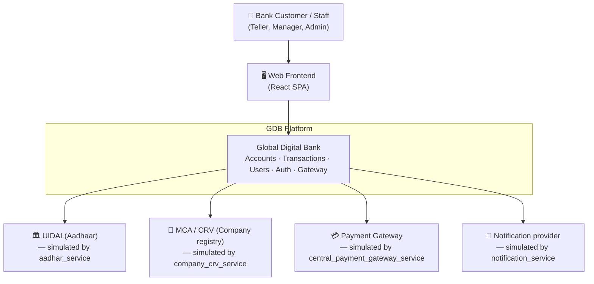

# C4 Level 1 — System Context

**GDB** is an online banking platform. This level shows who uses it and the
external systems it depends on. (In this training platform the "external" systems
are **simulated** by in-repo stub services — see the note below.)

## Actors

| Actor | Description |
|---|---|
| **Bank staff** | Tellers, Managers, Admins authenticate and perform banking operations (RBAC-gated). |
| **Web frontend** | React SPA that calls the platform through the API gateway. |

## External systems (simulated)

| System | Purpose | Simulated by |
|---|---|---|
| UIDAI | Aadhaar identity verification (KYC) | `aadhar_service` |
| MCA / CRV | Company registration verification | `company_crv_service` |
| Payment Gateway | Second-level payment authorization | `central_payment_gateway_service` |
| Notification provider | SMS/email/push notifications | `notification_service` |

> **Note.** Because this is a training platform, the "third-party" systems are
> implemented as GDB microservices (the **lite** tier). At Level 2 they appear as
> containers inside the platform boundary; conceptually they represent external
> systems.

Next: [Level 2 — Container](level-2-container.md).

