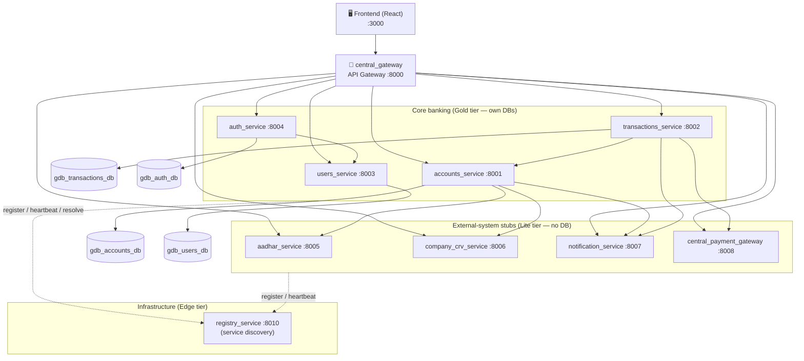

# C4 Level 2 — Container

Each **container** is a separately deployable process (a ASP.NET Core Web API service or a
database). Arrows are synchronous HTTP/JSON calls unless noted.

## Containers

| Container | Port | Responsibility | Data store |
|---|---|---|---|
| **central_gateway** | 8000 | Single entry point: routing/proxy, CORS, rate limiting | — |
| **accounts_service** | 8001 | Savings/current accounts, balances, debit/credit, KYC orchestration | `gdb_accounts_db` |
| **transactions_service** | 8002 | Deposits, withdrawals, transfers (saga), transaction logs, transfer limits | `gdb_transactions_db` |
| **users_service** | 8003 | User management (CRUD), roles, audit log | `gdb_users_db` |
| **auth_service** | 8004 | Login, JWT issuance/verification, token revocation, audit | `gdb_auth_db` |
| **aadhar_service** | 8005 | Aadhaar verification (UIDAI stub) | — |
| **company_crv_service** | 8006 | Company registration verification (MCA stub) | — |
| **notification_service** | 8007 | Notifications (stub) | — (in-memory) |
| **central_payment_gateway** | 8008 | Payment authorization (gateway stub) | — |
| **registry_service** | 8010 | Service discovery (register/heartbeat/resolve) | — (in-memory) |

## Key interactions

- **Frontend → Gateway → services** — all client traffic enters through the gateway.
- **auth → users** — auth verifies credentials against the users service (`/internal/v1/users/verify`).
- **accounts → aadhar/company/notification** — KYC verification on account opening + notifications.
- **transactions → accounts/payment/notification** — a transfer validates + debits/credits accounts, gets gateway approval, and notifies both parties (see the [fund-transfer sequence](../sequence-diagrams/fund-transfer.md)).
- **All services ↔ registry** — register on startup, heartbeat periodically, resolve peers.

## Cross-cutting (every container)

All services embed the same `gdb_common` middleware: correlation ID + W3C
`traceparent` propagation, structured JSON logs, Prometheus `/metrics`,
`/health` + `/live` + `/ready` probes, security headers, and a safe error
envelope. Inter-service calls carry `X-Internal-API-Key`; user calls carry a JWT.

Next: [Level 3 — Component](level-3-component.md).

