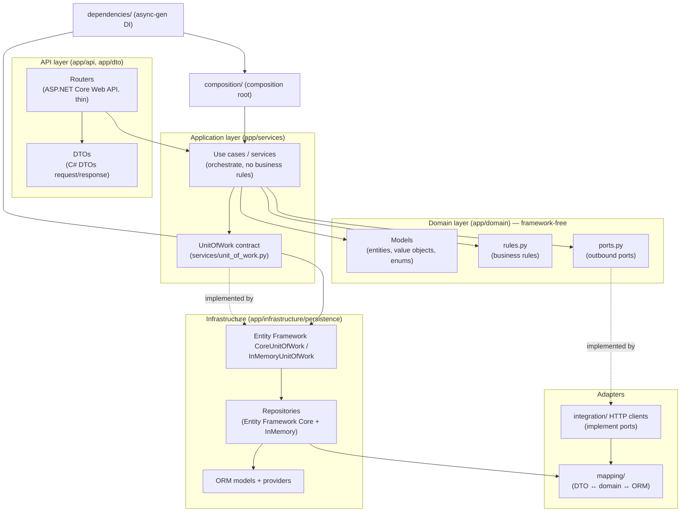

# C4 Level 3 — Component (accounts_service)

This zooms inside one **gold** container. `accounts_service` is the reference
implementation; every stateful service has the same components. Boxes are grouped
by architectural layer; arrows point **inward** (the dependency rule).

## Components

| Component | Folder | Responsibility |
|---|---|---|
| **Routers** | `api/` | HTTP endpoints; auth/RBAC dependency, (de)serialization. **No business logic.** |
| **DTOs** | `dto/` | Request/response schemas (C# DTOs). The wire contract. |
| **Use cases / services** | `services/` | Orchestrate a single operation: load via UoW, apply rules, persist, commit once. |
| **UnitOfWork contract** | `services/unit_of_work.py` | Abstract UoW the services depend on (exposes typed repositories + `commit`). |
| **Domain models** | `domain/models/` | Entities, value objects (e.g. `Money`), enums — pure C#. |
| **Business rules** | `domain/rules.py` | The single source of truth for invariants. |
| **Ports** | `domain/ports.py` | Abstract outbound collaborators (e.g. `AadhaarPort`, `NotificationPort`). |
| **UoW implementations** | `infrastructure/persistence/unit_of_work.py` | Own the `AsyncSession`; expose repositories; `commit`/`rollback`/`aclose`. |
| **Repositories** | `infrastructure/persistence/repositories/` | Entity Framework Core + InMemory implementations of the repository interfaces. |
| **ORM + providers** | `infrastructure/persistence/` | `orm_models.py`, `providers/` (provider factory + connection bootstrap). |
| **Integration clients** | `integration/` | HTTP clients implementing domain ports (aadhar, company, notification). |
| **Mapping** | `mapping/` | Explicit conversions between DTO, domain, and ORM. |
| **Composition root** | `composition/` | Wires the object graph (chooses provider, builds services). |
| **DI providers** | `dependencies/` | Async-generator dependencies: build a use case per request, `aclose` the UoW after. |

## The rules that hold this shape

1. **Domain imports no framework** — no ASP.NET Core Web API, Entity Framework Core, C# DTOs, or httpx in `domain/`.
2. **Services import no infrastructure** — they depend on the UoW *contract* and *ports*, not concretes.
3. **One repository interface per aggregate** lives in `repositories/interfaces/`; concretes live in infrastructure.
4. **Adapters implement ports/interfaces** — clients ⟶ ports, repositories ⟶ interfaces, UoW impl ⟶ UoW contract.

Both are enforced by `libs/gdb_common/tests/test_architecture.py`. See the
[coding standards](../../development/coding-standards.md) and
[adding a use case](../../development/adding-a-use-case.md).

