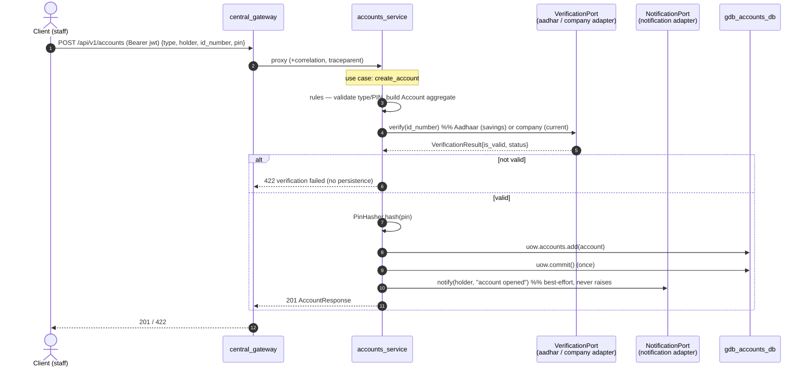

# Sequence — Account Creation (with KYC)

Opening an account runs KYC verification through a **single** `VerificationPort`
(savings → Aadhaar, current → company registration), persists the account
through the Unit of Work, and best-effort notifies the customer.

## Notes

- **One port, two adapters.** The only savings-vs-current difference is which
  `VerificationPort` adapter is injected (`aadhar_client` vs `company_client`) —
  chosen in the composition root, invisible to the use case (see
  [ADR-001](../adr/ADR-001-clean-architecture.md)).
- **Rules in the domain.** Account-type validity, PIN policy, and the aggregate's
  invariants live in `domain/` (`rules.py` + `Account`), not in the service.
- **PIN is never stored raw** — hashed via the `PinHasher` port before persist.
- **Verification failure ⇒ no write.** The `uow.commit()` only runs on the valid
  branch; a failed KYC leaves no partial account.
- **Notification is best-effort** — the `NotificationPort` adapter must not raise;
  a notification outage never fails account creation (it happens after commit).

## Failure modes

| Case | Result |
|---|---|
| KYC invalid | 422; nothing persisted |
| KYC provider down | `VerificationPort` raises infra error → 503; nothing persisted |
| Notification down | Account still created (201); notification dropped/logged |

