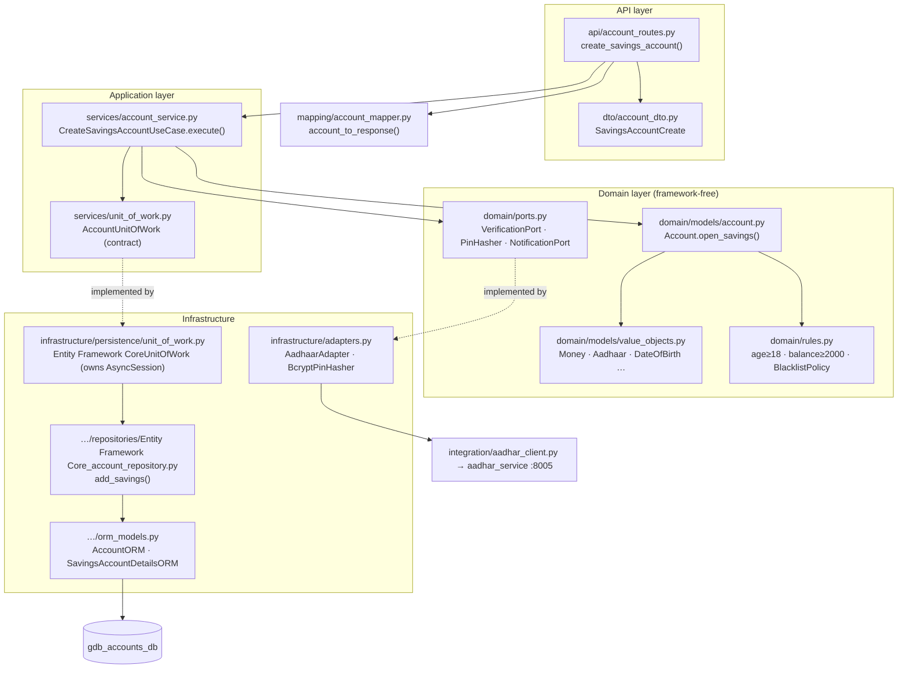
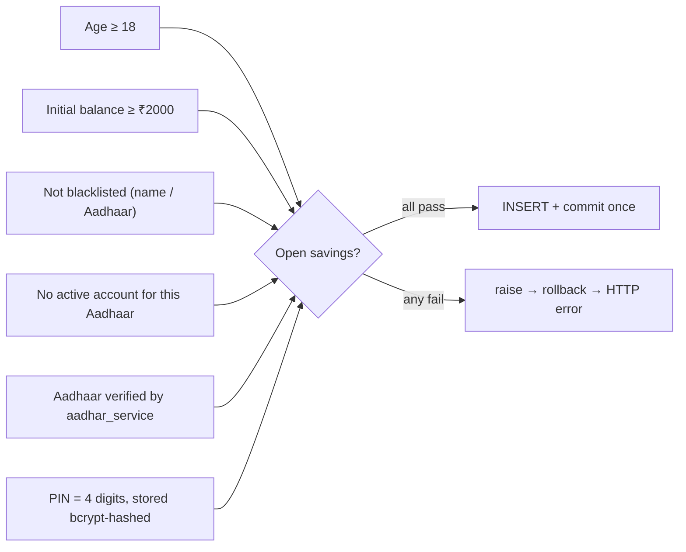
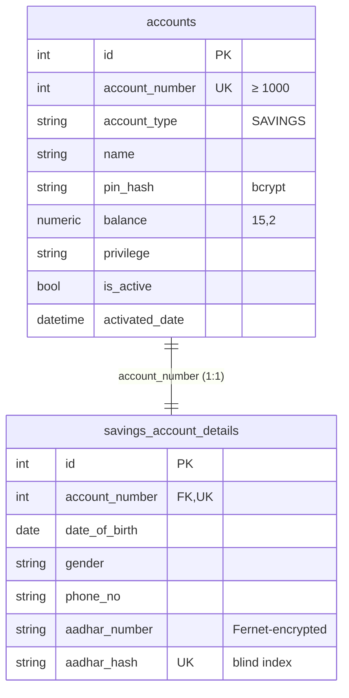

# accounts_service — Code-Level Flow

> Reference implementation. Owns **savings & current accounts**, balances, and KYC
> orchestration. Port **8001**, database **`gdb_accounts_db`**.

The primary write path documented here is **savings account creation**
(`POST /api/v1/accounts/savings`). Current-account creation is identical except
the KYC port (company registration) and a zero opening balance.

---

## 1. Layered architecture (dependency rule points inward)



## 2. Primary flow — savings account creation (code-level sequence)

```mermaid
sequenceDiagram
    autonumber
    actor C as Client (ADMIN/TELLER)
    participant R as account_routes.<br/>create_savings_account
    participant DI as providers.<br/>get_create_savings_use_case
    participant UC as CreateSavingsAccountUseCase
    participant V as utils/validators
    participant KYC as AadhaarAdapter → aadhar_service
    participant DOM as Account.open_savings
    participant UOW as Entity Framework CoreUnitOfWork
    participant REPO as Entity Framework CoreAccountRepository
    participant DB as gdb_accounts_db

    C->>R: POST /api/v1/accounts/savings (JWT + JSON body)
    Note over R: ASP.NET Core Web API validates body → SavingsAccountCreate (422 if invalid)
    R->>DI: resolve use case
    DI->>UOW: build per-request UoW (owns AsyncSession)
    R->>UC: execute(request)
    UC->>V: name, age≥18, pin, phone, privilege
    UC->>UC: BlacklistPolicy check (name / aadhaar)
    UC->>REPO: has_active_aadhaar(aadhaar)  %% duplicate check
    UC->>KYC: verify(aadhaar)
    KYC-->>UC: VerificationResult(is_valid)
    alt not valid
        UC->>KYC: notify(failure) ; raise InvalidAadharNumberError
    end
    UC->>UC: pin_hash = BcryptPinHasher.hash(pin)
    UC->>DOM: open_savings(...) %% age + min-balance invariants
    DOM-->>UC: Account (number=None)
    rect rgb(235,255,235)
    UC->>UOW: async with uow:
    UC->>REPO: add_savings(account, pin)
    REPO->>DB: INSERT accounts + savings_account_details (flush)
    REPO-->>UC: account_number (≥1000)
    UC->>UOW: commit() (once)
    end
    UC->>UC: account.assign_number(number)
    UC->>KYC: notify(welcome)  %% best-effort
    UC-->>R: Account
    R->>R: AccountMapper.account_to_response(account)
    R-->>C: 201 Created (AccountResponse)
    Note over DI: finally → uow.aclose() releases the session
```

## 3. Layer-by-layer walkthrough

| # | Layer | File · symbol | What happens |
|---|---|---|---|
| 1 | **API** | [account_routes.py](../../accounts_service/app/api/account_routes.py) · `create_savings_account` | `POST /api/v1/accounts/savings`; auth `require_admin_or_teller()`; body parsed into DTO; returns `AccountResponse` (201). Thin — no business logic. |
| 2 | **DTO** | [account_dto.py](../../accounts_service/app/dto/account_dto.py) · `SavingsAccountCreate` | `name, privilege, pin, date_of_birth, gender, phone_no, aadhar_number, initial_balance` + bank identity; inline validators for DOB/phone/Aadhaar. |
| 3 | **DI** | [providers.py](../../accounts_service/app/dependencies/providers.py) · `get_create_savings_use_case` | Builds the per-request UoW + use case; `uow.aclose()` in `finally`. |
| 4 | **Use case** | [account_service.py](../../accounts_service/app/services/account_service.py) · `CreateSavingsAccountUseCase.execute` | Orchestrates: validate → blacklist → duplicate → KYC → hash → build → persist → notify. |
| 5 | **Domain** | [account.py](../../accounts_service/app/domain/models/account.py) · `Account.open_savings` | Factory enforcing age ≥ 18 and initial balance ≥ ₹2000; builds the aggregate. |
| 6 | **Rules/ports** | [rules.py](../../accounts_service/app/domain/rules.py), [ports.py](../../accounts_service/app/domain/ports.py) | Constants + `BlacklistPolicy`; `VerificationPort`/`PinHasher`/`NotificationPort`. |
| 7 | **Adapters** | [adapters.py](../../accounts_service/app/infrastructure/adapters.py) · `AadhaarAdapter`, `BcryptPinHasher` | `verify()` → `AadharClient` → HTTP `aadhar_service`; bcrypt PIN hash. |
| 8 | **Repository** | [Entity Framework Core_account_repository.py](../../accounts_service/app/infrastructure/persistence/repositories/Entity Framework Core_account_repository.py) · `add_savings` | Aadhaar blind-index uniqueness; `account_number = max+1` (floor 1000); inserts both ORM rows; `flush()`; **no commit**. |
| 9 | **Unit of Work** | [unit_of_work.py](../../accounts_service/app/infrastructure/persistence/unit_of_work.py) · `Entity Framework CoreUnitOfWork` | Owns the `AsyncSession`; `commit()` once; rolls back on exception; `aclose()` releases. |
| 10 | **Mapping** | [account_mapper.py](../../accounts_service/app/mapping/account_mapper.py) · `account_to_response` | Domain → `AccountResponse`. (Domain → ORM is done inline in the repo.) |
| 11 | **Database** | [orm_models.py](../../accounts_service/app/infrastructure/persistence/orm_models.py) | Writes `accounts` + `savings_account_details`. |

## 4. Endpoint map

| Method | Route | Handler | Auth |
|---|---|---|---|
| POST | `/api/v1/accounts/savings` | `create_savings_account` | ADMIN / TELLER |
| POST | `/api/v1/accounts/current` | `create_current_account` | ADMIN / TELLER |
| GET | `/api/v1/accounts` | `get_all_accounts` | ADMIN / TELLER / MANAGER |
| GET | `/api/v1/accounts/summary` | `get_accounts_summary` | ADMIN / TELLER / MANAGER |
| GET | `/api/v1/accounts/{account_number}` | `get_account` | ADMIN / TELLER / MANAGER |
| GET | `/api/v1/accounts/{account_number}/balance` | balance | ADMIN / TELLER / MANAGER |
| PUT | `/api/v1/accounts/{account_number}` | `update_account` | ADMIN / TELLER |
| POST | `/api/v1/accounts/{account_number}/activate` · `/inactivate` · `/close` | lifecycle | ADMIN / TELLER |
| POST | `/api/v1/accounts/{account_number}/verify-pin` | verify PIN | ADMIN / TELLER / MANAGER |
| — | `/api/v1/internal/...` | debit / credit / details / privilege (service-to-service) | Internal API key |

## 5. Business rules enforced



1. **Age ≥ 18** — `Account.open_savings` (`MIN_SAVINGS_AGE`).
2. **Initial balance ≥ ₹2000** — `Account.open_savings` (`MIN_SAVINGS_INITIAL_BALANCE`).
3. **Blacklist** — `BlacklistPolicy` rejects known names / Aadhaar numbers.
4. **One active account per Aadhaar** — `has_active_aadhaar` + DB-unique `aadhar_hash`.
5. **External KYC** — Aadhaar verified via `aadhar_service` before any write.
6. **PIN never stored raw** — bcrypt hash only.
7. **Aadhaar encrypted at rest** — Fernet ciphertext + deterministic blind index.
8. **Account number ≥ 1000**, unique, app-assigned.
9. **Atomicity** — both rows commit once; any failure rolls back (no partial account).

## 6. Exception points → HTTP

| Raised in | Condition | Exception | HTTP |
|---|---|---|---|
| ASP.NET Core Web API/C# DTOs | Malformed body / bad field | validation error | **422** |
| `utils/validators` | Bad name/pin/phone/privilege | `ValidationError` / `InvalidPinError` | **400** |
| `Account.open_savings` | Age < 18 | `AgeRestrictionError` | **400** |
| `Account.open_savings` | Balance < ₹2000 | `ValidationError` | **400** |
| Use case | Blacklisted | `ValidationError` | **400** |
| Use case / repo | Duplicate active Aadhaar | `ValidationError` / `DuplicateConstraintError` | **400** |
| `AadhaarAdapter.verify` | Invalid / unreachable KYC | `InvalidAadharNumberError` / wrapped `ValidationError` | **400** |
| route `except Exception` | Anything unexpected | generic | **500** |

*(All domain/app exceptions subclass `AccountException`; the route maps
`AccountException → 400 {error_code, message}` and `Exception → 500`.)*

## 7. Database



- **`accounts`** (`AccountORM`) — one row: identity, `pin_hash`, `balance`, privilege, bank identity, `is_active`, `activated_date`.
- **`savings_account_details`** (`SavingsAccountDetailsORM`) — one row: DOB, gender, phone, **encrypted** Aadhaar + unique blind-index hash.
- Same portable schema on sqlite/mysql/postgres/supabase (see [ADR-006](../architecture/adr/ADR-006-provider-strategy.md)).

---

**Related:** [architecture account-creation sequence](../architecture/sequence-diagrams/account-creation.md) · [system architecture](../architecture/system-architecture.md) · [C4 component (accounts)](../architecture/c4/level-3-component.md)


