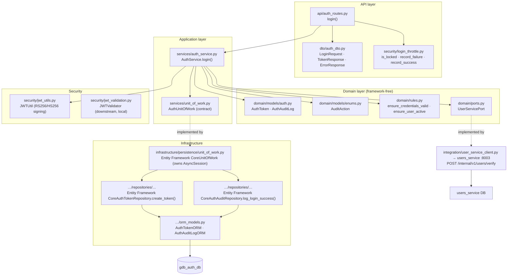
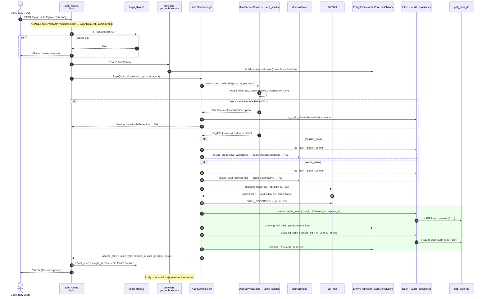
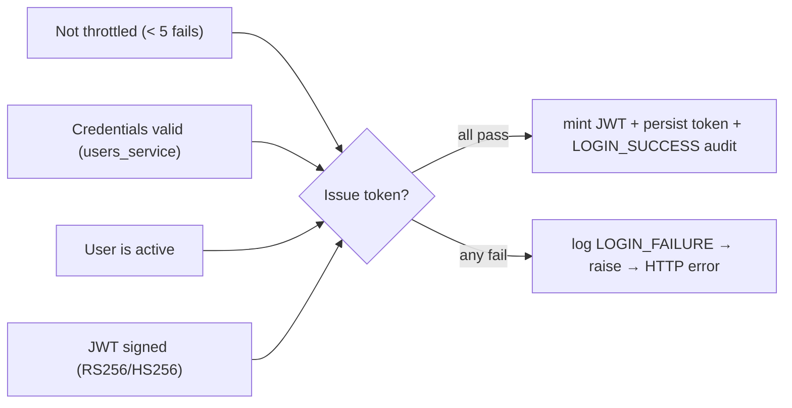
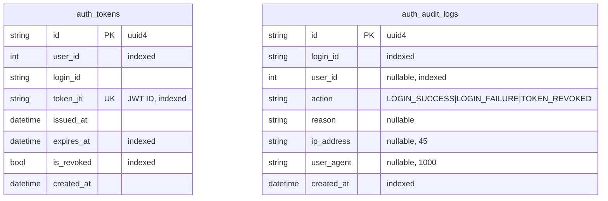

# auth_service — Code-Level Flow

> Authenticates users and issues JWTs. Owns **auth tokens** (issued/revoked JWT
> references) and the **authentication audit trail** — it stores **no passwords**;
> credentials are verified by the Users Service. Port **8004**, database
> **`gdb_auth_db`**.

The primary path documented here is **user login**
(`POST /api/v1/auth/login`): auth throttles the identifier, verifies credentials
against `users_service`, mints a signed JWT, then persists the token and a
`LOGIN_SUCCESS` audit record. Downstream services never call back here to check a
token — they validate the JWT locally with the shared `gdb_common` validator.

---

## 1. Layered architecture (dependency rule points inward)

## 2. Primary flow — user login (code-level sequence)

## 3. Layer-by-layer walkthrough

| # | Layer | File · symbol | What happens |
|---|---|---|---|
| 1 | **API** | [auth_routes.py](../../auth_service/app/api/auth_routes.py) · `login` | `POST /api/v1/auth/login`; no auth dep (public); throttle check → delegate → map exceptions to HTTP; returns `TokenResponse` (200). Thin. |
| 2 | **DTO** | [auth_dto.py](../../auth_service/app/dto/auth_dto.py) · `LoginRequest` / `TokenResponse` | Request: `login_id`, `password` (length-validated). Response: `access_token`, `token_type`, `expires_in`, `user_id`, `login_id`, `role`. |
| 3 | **Throttle** | [login_throttle.py](../../auth_service/app/security/login_throttle.py) · `is_locked` / `record_failure` / `record_success` | Per-identifier lockout: 5 consecutive failures → locked 15 min. In-memory, **per-process** (needs Redis in prod). |
| 4 | **DI** | [providers.py](../../auth_service/app/dependencies/providers.py) · `get_auth_service` | Async-generator: builds per-request UoW + `AuthService`, yields, and `uow.aclose()` in `finally`. |
| 5 | **Use case** | [auth_service.py](../../auth_service/app/services/auth_service.py) · `AuthService.login` | Orchestrates: verify creds → rules → mint JWT → persist token → audit. Instance-based, holds the UoW + `UserServicePort`. |
| 6 | **Port** | [ports.py](../../auth_service/app/domain/ports.py) · `UserServicePort` | Abstract `verify_user_credentials`; use case depends on this, never the HTTP client. |
| 7 | **Rules** | [rules.py](../../auth_service/app/domain/rules.py) · `ensure_credentials_valid`, `ensure_user_active` | Pure guards raising `InvalidCredentialsException` / `UserInactiveException`. |
| 8 | **Domain models** | [auth.py](../../auth_service/app/domain/models/auth.py), [enums.py](../../auth_service/app/domain/models/enums.py) | `AuthToken` (jti + lifecycle), `AuthAuditLog`; `AuditAction` = LOGIN_SUCCESS / LOGIN_FAILURE / TOKEN_REVOKED. |
| 9 | **Security** | [jwt_utils.py](../../auth_service/app/security/jwt_utils.py) · `JWTUtil.generate_token` | Mints JWT with `sub, login_id, role, iat, exp, jti`; **RS256** when a private key is set, else legacy **HS256**. |
| 10 | **Integration** | [user_service_client.py](../../auth_service/app/integration/user_service_client.py) · `UserServiceClient.verify_user_credentials` | HTTP `POST users_service /internal/v1/users/verify` with `X-Internal-API-Key`; 200 → payload, 401/404 → `None`, other/HTTP error → `ServiceUnavailableException`. |
| 11 | **Unit of Work** | [unit_of_work.py](../../auth_service/app/infrastructure/persistence/unit_of_work.py) · `Entity Framework CoreUnitOfWork` | Owns the `AsyncSession`; binds token + audit repos; `commit()` / `rollback()`; `aclose()` releases. |
| 12 | **Repositories** | [Entity Framework Core_repositories.py](../../auth_service/app/infrastructure/persistence/repositories/Entity Framework Core_repositories.py) · `create_token`, `log_login_success` | Insert + `flush()`, **no commit** (UoW commits). Dialect-neutral SQL, app-generated uuid4 ids. |
| 13 | **Database** | [orm_models.py](../../auth_service/app/infrastructure/persistence/orm_models.py) · `AuthTokenORM`, `AuthAuditLogORM` | Writes `auth_tokens` + `auth_audit_logs`; portable column types across sqlite/mysql/postgres/supabase. |

## 4. Endpoint map

| Method | Route | Handler | Auth |
|---|---|---|---|
| POST | `/api/v1/auth/login` | `login` | Public (throttled) |
| GET | `/api/v1/auth/verify` | `verify_token` | Bearer JWT (in header) |
| POST | `/api/v1/auth/logout` | `logout` | Bearer JWT (best-effort) |
| POST | `/api/v1/auth/register` | `register` | Always **403** (managed by ADMIN via Users Service) |
| GET | `/api/v1/auth/health` | `health_check` | Public |

*Downstream services do NOT call `/verify` per request — they validate the JWT
locally via `gdb_common.jwt_validation` (see [jwt_validation.py](../../auth_service/app/security/jwt_validation.py)).
`/verify` exists mainly for the frontend to confirm a session on refresh.*

## 5. Business rules enforced

1. **No stored passwords** — credential verification is delegated to
   `users_service` (`/internal/v1/users/verify`); auth persists only token
   metadata and audit rows.
2. **Brute-force throttling** — `login_throttle` locks an identifier for 15 min
   after 5 consecutive failures; success clears the counter (**429** while locked).
3. **Credentials valid** — `rules.ensure_credentials_valid` rejects a missing
   user payload (401).
4. **User active** — `rules.ensure_user_active` rejects inactive accounts (401).
5. **Stateless JWT** — token carries `sub, login_id, role, iat, exp, jti`; signed
   RS256 when a private key is configured, else legacy HS256. Downstream services
   verify locally (both algs accepted during migration).
6. **Best-effort persistence** — token store and audit each commit through the
   UoW, but a persistence failure is logged and **never** fails an otherwise
   successful login.
7. **Failure auditing** — every rejected attempt writes a `LOGIN_FAILURE` audit
   row (best-effort) before raising.
8. **Token revocation on logout** — only a signature-valid token may revoke its
   own `jti`; `verify_token` fails **closed** if the revocation check errors.
9. **No self-registration** — `/register` always returns 403.

## 6. Exception points → HTTP

| Raised in | Condition | Exception | HTTP |
|---|---|---|---|
| ASP.NET Core Web API/C# DTOs | Malformed body / bad field length | validation error | **422** |
| `auth_routes.login` | Identifier locked out | `HTTPException` (throttle) | **429** |
| `UserServiceClient` → route | User not found | `UserNotFoundException` | **404** |
| `rules.ensure_user_active` | User inactive | `UserInactiveException` | **401** |
| `rules.ensure_credentials_valid` | Invalid credentials / no user | `InvalidCredentialsException` | **401** |
| `UserServiceClient` | users_service unreachable / non-2xx | `ServiceUnavailableException` | **503** |
| route `except Exception` | Anything unexpected (e.g. JWT mint fails) | generic | **500** |
| `/verify` | Missing/invalid bearer, verify fails | `HTTPException` | **401** |
| `/register` | Always | `HTTPException` | **403** |

*(Login maps each auth exception to its status explicitly and clears/records the
throttle counter on the success/invalid-credentials paths; unmapped errors → 500.
`/logout` swallows all errors and always returns 200.)*

## 7. Database

- **`auth_tokens`** (`AuthTokenORM`) — one row per issued JWT: `user_id`,
  `login_id`, unique `token_jti`, issue/expiry timestamps, and the `is_revoked`
  flag flipped by logout. Revocation status is read here by `verify_token`.
- **`auth_audit_logs`** (`AuthAuditLogORM`) — append-only trail of authentication
  events (`LOGIN_SUCCESS`, `LOGIN_FAILURE`, `TOKEN_REVOKED`) with reason, client
  IP, and user agent. The two tables are independent (no FK); rows are correlated
  by `user_id` / `login_id`.
- Same portable schema on sqlite/mysql/postgres/supabase — UUID PKs stored as
  `String(36)`, BIGINT → `Integer`, native ENUM → `String`, INET → `String(45)`
  (see [ADR-006](../architecture/adr/ADR-006-provider-strategy.md)).

---

**Related:** [accounts-service flow](accounts-service-flow.md) · [system architecture](../architecture/system-architecture.md) · [C4 component](../architecture/c4/level-3-component.md)

