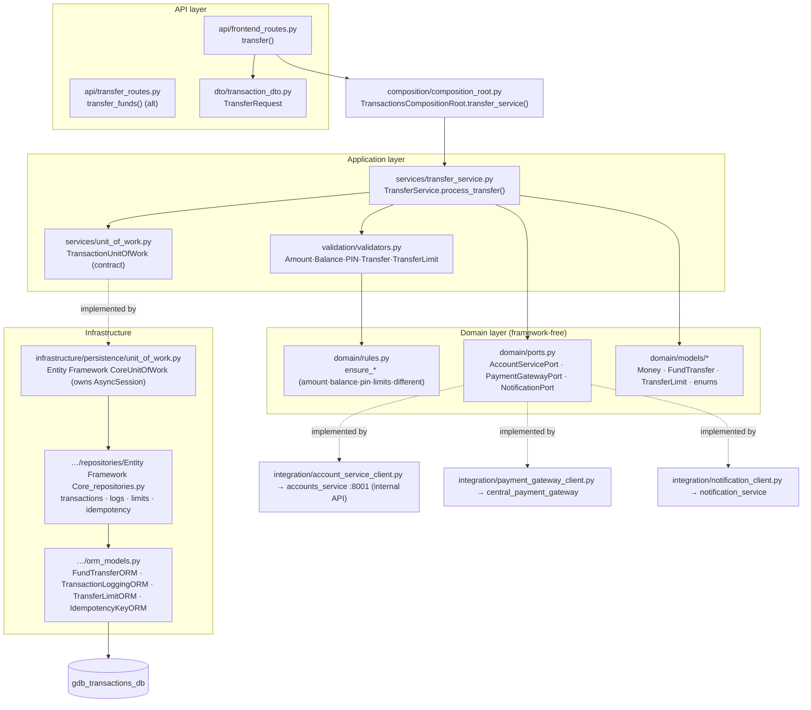
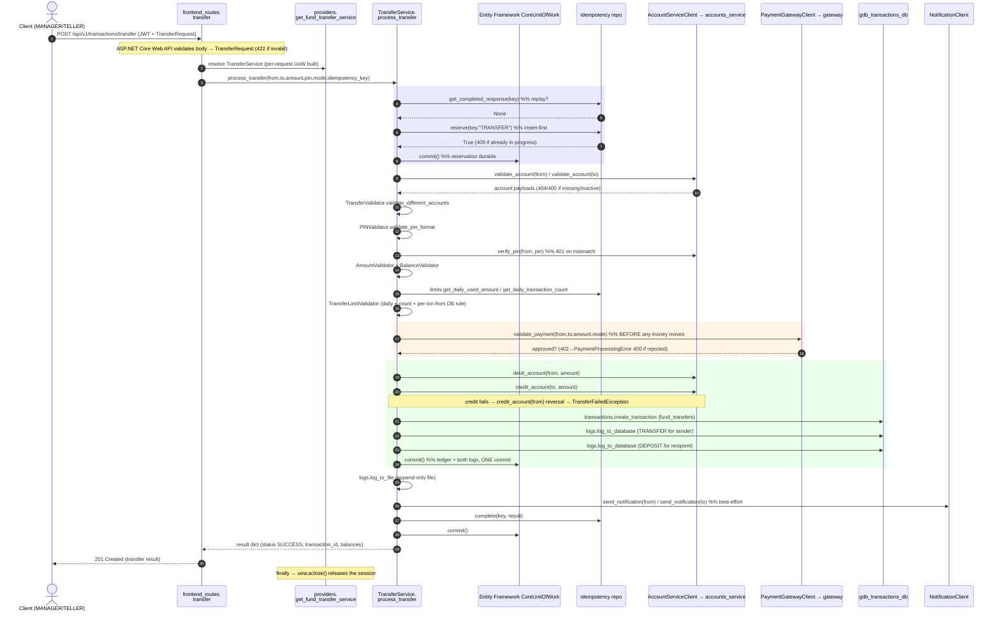
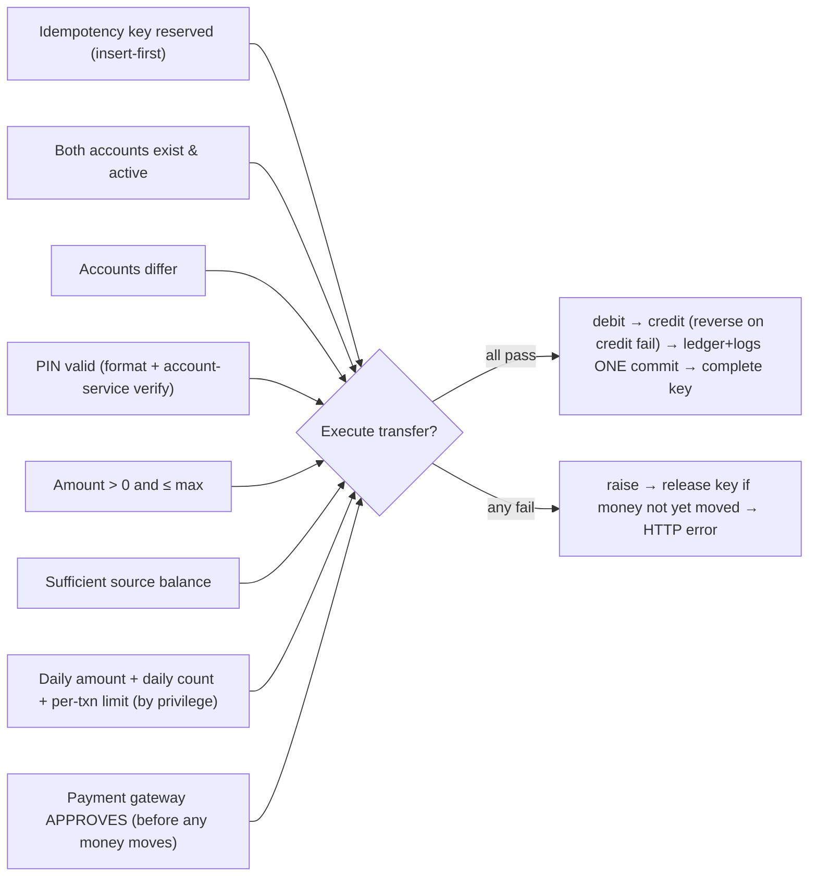
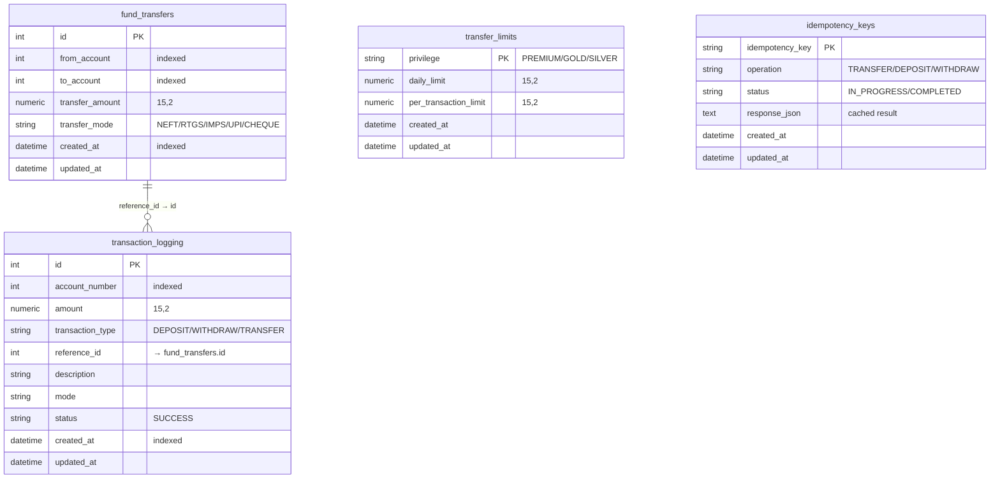

# transactions_service — Code-Level Flow

> Owns **money movement** — deposits, withdrawals, fund transfers — plus the
> local transaction **ledger + audit logs**, per-privilege **transfer limits**,
> and **idempotency** keys. Port **8002**, database **`gdb_transactions_db`**.

The primary write path documented here is the **fund transfer**
(`POST /api/v1/transactions/transfer`) — the richest flow: a cross-service SAGA
that reserves an idempotency key, validates both accounts + PIN + limits, gets
**payment-gateway approval before any money moves**, then debits the source and
credits the destination (with a compensating reversal on credit failure) and
records the ledger + both log legs in **one local commit**. Deposit and
withdrawal are simpler single-account variants of the same skeleton.

---

## 1. Layered architecture (dependency rule points inward)

## 2. Primary flow — fund transfer (code-level sequence)

## 3. Layer-by-layer walkthrough

| # | Layer | File · symbol | What happens |
|---|---|---|---|
| 1 | **API** | [frontend_routes.py](../../transactions_service/app/api/frontend_routes.py) · `transfer` | `POST /api/v1/transactions/transfer` (router prefix `/api/v1/transactions`); auth `require_manager_or_teller_dependency`; parses `TransferRequest` body; resolves `TransferMode` (falls back to `NEFT` on unknown); reads `Idempotency-Key` header; returns the service result (201). Thin — no business logic. |
| 1b | **API (alt)** | [transfer_routes.py](../../transactions_service/app/api/transfer_routes.py) · `transfer_funds` | Equivalent `POST /api/v1/transfers` using **query params** instead of a JSON body; same auth + same `TransferService`. |
| 2 | **DTO** | [transaction_dto.py](../../transactions_service/app/dto/transaction_dto.py) · `TransferRequest` | `from_account, to_account, amount (>0), pin, transfer_mode` (defaults `NEFT`). `FundTransferCreate`/`Response` are the ledger record schemas. |
| 3 | **DI** | [providers.py](../../transactions_service/app/dependencies/providers.py) · `get_fund_transfer_service` | Asks the composition root for a per-request session-owning UoW, builds `TransferService`, `uow.aclose()` in `finally`. |
| 4 | **Composition** | [composition_root.py](../../transactions_service/app/composition/composition_root.py) · `TransactionsCompositionRoot.transfer_service` | Wires the UoW + the three outbound ports (account/gateway/notifier singletons) into `TransferService`. |
| 5 | **Use case** | [transfer_service.py](../../transactions_service/app/services/transfer_service.py) · `TransferService.process_transfer` | The saga: idempotency reserve → validate accounts → PIN → amount → balance → daily/count/per-txn limits → **gateway approval** → debit → credit (reversal on failure) → ledger + logs (one commit) → notifications → idempotency complete. |
| 6 | **Validators** | [validators.py](../../transactions_service/app/validation/validators.py) · `Amount/Balance/PIN/Transfer/TransferLimit Validator` | Thin facade resolving `settings` limits and delegating to the domain rules. |
| 7 | **Domain rules** | [rules.py](../../transactions_service/app/domain/rules.py) · `ensure_*` | Pure functions raising the exact money-movement exceptions: amount bounds, sufficient balance, PIN format, daily amount/count, per-transaction ceiling, different accounts. |
| 8 | **Ports** | [ports.py](../../transactions_service/app/domain/ports.py) · `AccountServicePort · PaymentGatewayPort · NotificationPort` | Abstractions the use case depends on; concrete HTTP clients implement them. |
| 9 | **Domain models** | [fund_transfer.py](../../transactions_service/app/domain/models/fund_transfer.py), [transfer_limit.py](../../transactions_service/app/domain/models/transfer_limit.py), [enums.py](../../transactions_service/app/domain/models/enums.py) | `FundTransfer` entity, `TransferLimit`/`Money` value objects, `TransactionType`/`TransferMode`/`PrivilegeLevel` enums. |
| 10 | **Unit of Work** | [unit_of_work.py](../../transactions_service/app/infrastructure/persistence/unit_of_work.py) · `Entity Framework CoreUnitOfWork` | Owns the `AsyncSession`; binds the four repos (`.transactions/.logs/.limits/.idempotency`); commits per logical step; `aclose()` releases. In-memory variant treats commit/rollback as no-ops. |
| 11 | **Repositories** | [Entity Framework Core_repositories.py](../../transactions_service/app/infrastructure/persistence/repositories/Entity Framework Core_repositories.py) · `Entity Framework Core{Transaction,TransactionLog,TransferLimit,Idempotency}Repository` | Write through the UoW session **without committing**; `Idempotency.reserve` is insert-first (duplicate → `IntegrityError` → rollback → `False`; real error fails CLOSED → `DatabaseException`). |
| 12 | **Integration** | [account_service_client.py](../../transactions_service/app/integration/account_service_client.py), [payment_gateway_client.py](../../transactions_service/app/integration/payment_gateway_client.py), [notification_client.py](../../transactions_service/app/integration/notification_client.py) | HTTP clients (internal API key + traceparent + correlation id). Account calls go through a `CircuitBreaker`; gateway resolves any failure to `False` (fail-closed); notifications swallow errors. |
| 13 | **ORM / DB** | [orm_models.py](../../transactions_service/app/infrastructure/persistence/orm_models.py) | Writes `fund_transfers`, `transaction_logging`, `idempotency_keys`; reads `transfer_limits`. |

## 4. Endpoint map

| Method | Route | Handler | Auth |
|---|---|---|---|
| POST | `/api/v1/transactions/transfer` | `frontend_routes.transfer` | MANAGER / TELLER |
| POST | `/api/v1/transactions/deposit` | `frontend_routes.deposit` | MANAGER / TELLER |
| POST | `/api/v1/transactions/withdraw` | `frontend_routes.withdraw` | MANAGER / TELLER |
| GET | `/api/v1/transactions` | `frontend_routes.get_all_transactions` | ADMIN / TELLER / MANAGER |
| GET | `/api/v1/transactions/account/{account_number}` | `frontend_routes.get_transactions_by_account` | any authenticated user |
| POST | `/api/v1/transfers` | `transfer_routes.transfer_funds` (query-param alt) | MANAGER / TELLER |
| POST | `/api/v1/deposits` · `/api/v1/withdrawals` | deposit / withdraw routers | MANAGER / TELLER |
| — | `/api/v1/transfer-limits` | transfer-limit CRUD | (see transfer_limit_routes) |
| — | `/api/v1/transaction-logs` | log queries | (see transaction_log_routes) |
| GET | `/api/v1/health` · `/ready` · `/live` | health/readiness/liveness | none |

## 5. Business rules enforced

1. **Idempotency (insert-first)** — a COMPLETED key replays its stored result; a
   still-in-progress duplicate is rejected **409**; the reservation is committed
   before work starts and **released** only if the request fails *before* money
   moved (`money_moved` guard).
2. **Both accounts valid & active** — `validate_account(from)` and
   `validate_account(to)` against accounts_service (`404`/`400`).
3. **Different accounts** — `ensure_different_accounts` (`400`).
4. **PIN** — format checked locally, then `verify_pin` against accounts_service
   (`401` on mismatch).
5. **Amount** — `> 0` and `≤ MAXIMUM_TRANSACTION_AMOUNT` (`400`).
6. **Sufficient balance** — source `balance ≥ amount` (`400`).
7. **Limits by privilege** — daily cumulative amount, daily transfer count, and a
   **per-transaction ceiling** (preferring the DB `transfer_limits` rule, falling
   back to `settings.TRANSFER_LIMITS`) (`400`).
8. **Gateway approval first** — `validate_payment` must return true **before any
   debit/credit**; rejection raises `PaymentProcessingError` (`400`,
   `PAYMENT_GATEWAY_ERROR`).
9. **Atomic money movement by compensation** — debit then credit are two
   independent account-service calls; if the credit fails after a successful
   debit, the debit is **reversed** (refund) and `TransferFailedException` is
   raised. Once both legs settle (`money_moved = True`), a later ledger/log
   failure must **not** release the idempotency key.
10. **Single local commit for the record** — the `fund_transfers` row + both
    `transaction_logging` legs (TRANSFER for sender, DEPOSIT for recipient) are
    written and committed **once**.
11. **Best-effort side effects** — file log and customer notifications never
    block or fail the transfer.

## 6. Exception points → HTTP

| Raised in | Condition | Exception | HTTP |
|---|---|---|---|
| ASP.NET Core Web API/C# DTOs | Malformed body / bad field | validation error | **422** |
| `AccountServiceClient.verify_pin` / `PINValidator` | Wrong or malformed PIN | `InvalidPINException` | **401** |
| `AccountServiceClient.validate_account` | Account missing | `AccountNotFoundException` | **404** |
| `AccountServiceClient.validate_account` | Account inactive | `AccountNotActiveException` | **400** |
| `ensure_different_accounts` | Same source & dest | `SameAccountTransferException` | **400** |
| `ensure_amount_within_bounds` | Amount ≤ 0 or > max | `InvalidAmountException` | **400** |
| `ensure_sufficient_balance` | Balance < amount | `InsufficientFundsException` | **400** |
| `TransferLimitValidator` | Daily amount / per-txn ceiling exceeded | `TransferLimitExceededException` | **400** |
| `TransferLimitValidator` | Daily transfer count exceeded | `DailyTransactionCountExceededException` | **400** |
| gateway step | Gateway rejects (or unreachable → False) | `PaymentProcessingError` (`PAYMENT_GATEWAY_ERROR`) | **400** |
| idempotency step | Duplicate key still in progress | `IdempotencyException` | **409** |
| account/gateway clients | Downstream down / circuit open | `ServiceUnavailableException` | **503** |
| credit leg | Credit failed after debit (debit reversed) | `TransferFailedException` | **400** |
| `process_transfer` `except Exception` | Anything unexpected (wrapped) | `TransferFailedException` | **400** |
| route `except Exception` / global handler | Non-`TransactionException` escapes | generic | **500** |

*(All service errors subclass `TransactionException`, which carries its own
`http_code`/`error_code`. Both the route's `except TransactionException` and the
app-level `@app.exception_handler(TransactionException)` in
[main.py](../../transactions_service/app/main.py) render
`{error_code, message}` at `exc.http_code`. Note: the use case wraps most
unexpected errors into `TransferFailedException` (400), so a raw **500** is rare —
it appears only for errors that escape as a plain `Exception`.)*

## 7. Database

Tables written by the transfer flow:

- **`idempotency_keys`** (`IdempotencyKeyORM`) — one row per key: inserted
  `IN_PROGRESS` at reserve (committed immediately), updated to `COMPLETED` with
  the cached `response_json` at the end, or **deleted** on release when the
  request fails before money moved.
- **`fund_transfers`** (`FundTransferORM`) — the ledger record: source,
  destination, amount, mode, timestamps. Its `id` becomes the `reference_id`
  linking the two log legs.
- **`transaction_logging`** (`TransactionLoggingORM`) — two rows per transfer: a
  `TRANSFER` leg for the sender and a `DEPOSIT` leg for the recipient, both
  referencing the transfer id. Written + committed together with the ledger row.
- **`transfer_limits`** (`TransferLimitORM`) — **read** (not written) during the
  transfer to source the per-transaction ceiling by privilege (with a
  `settings.TRANSFER_LIMITS` fallback).
- Same portable schema on sqlite/mysql/postgres/supabase (portable column types
  in `orm_models.py`; the in-memory provider mirrors the same repository
  contracts).

---

**Related:** [accounts_service flow](accounts-service-flow.md) · [system architecture](../architecture/system-architecture.md)

