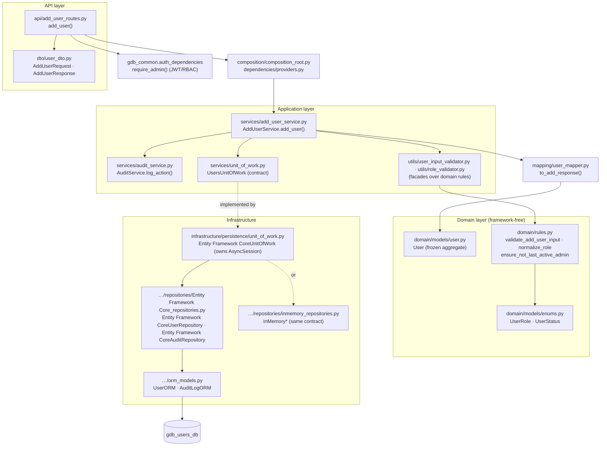
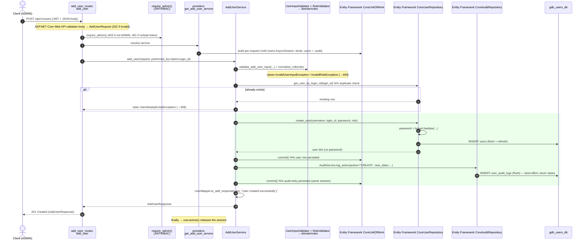
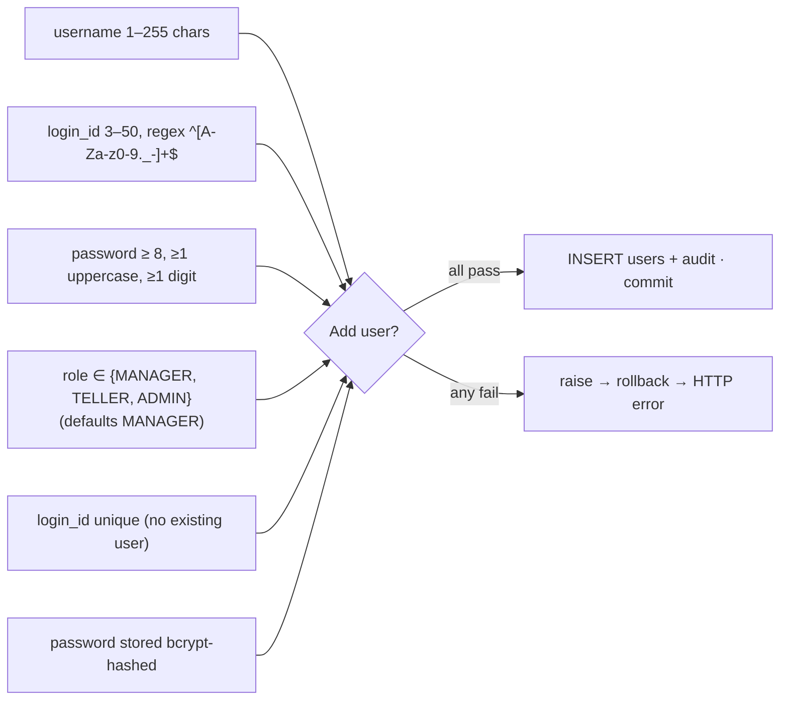
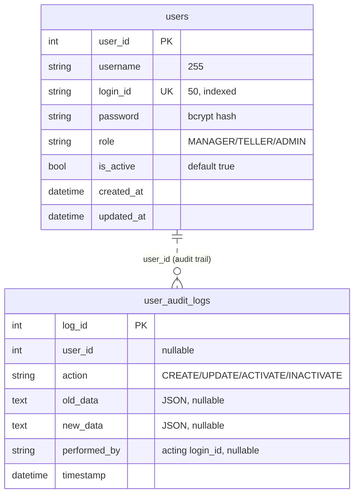

# users_service — Code-Level Flow

> Owns **user management** (staff accounts: username, `login_id`, password hash,
> role, active status) and the **user-management audit trail**. RBAC-guarded
> (JWT). Port **8003**, database **`gdb_users_db`**.

The primary write path documented here is **add user**
(`POST /api/v1/users`, ADMIN only). It creates a `users` row and, through the
same unit of work, writes a best-effort entry to `user_audit_logs`.

---

## 1. Layered architecture (dependency rule points inward)

## 2. Primary flow — add user (code-level sequence)

## 3. Layer-by-layer walkthrough

| # | Layer | File · symbol | What happens |
|---|---|---|---|
| 1 | **API** | [add_user_routes.py](../../users_service/app/api/add_user_routes.py) · `add_user` | `POST /api/v1/users`; auth `require_admin()`; body parsed into `AddUserRequest`; passes `performed_by=claims.login_id`; maps exceptions → HTTP; returns `AddUserResponse` (201). Thin — no business logic. |
| 2 | **DTO** | [user_dto.py](../../users_service/app/dto/user_dto.py) · `AddUserRequest` / `AddUserResponse` | Request: `username` (1–255), `login_id` (3–50, regex `^[a-zA-Z0-9._-]+$`), `password` (min 8), optional `role` (defaults MANAGER). Inline validators for `login_id` format and password length. Response never carries the password. |
| 3 | **DI** | [providers.py](../../users_service/app/dependencies/providers.py) · `get_add_user_service` | Async-generator dependency: builds the per-request UoW + service via the composition root; `uow.aclose()` in `finally`. |
| 4 | **Composition** | [composition_root.py](../../users_service/app/composition/composition_root.py) · `UsersCompositionRoot` | Only place wiring UoW + mapper + services; `unit_of_work()` delegates to the active DB provider (`get_provider()`). |
| 5 | **Use case** | [add_user_service.py](../../users_service/app/services/add_user_service.py) · `AddUserService.add_user` | Orchestrates: validate → normalize role → dedupe → create → commit → audit → commit → map. |
| 6 | **Validators** | [user_input_validator.py](../../users_service/app/utils/user_input_validator.py), [role_validator.py](../../users_service/app/utils/role_validator.py) | Thin facades delegating to `domain/rules` (single source of truth). |
| 7 | **Domain rules** | [rules.py](../../users_service/app/domain/rules.py) | `validate_add_user_input` (name/login_id/password policy: min 8 + one uppercase + one digit), `normalize_role`, `ensure_not_last_active_admin`. |
| 8 | **Domain model** | [user.py](../../users_service/app/domain/models/user.py), [enums.py](../../users_service/app/domain/models/enums.py) | Frozen `User` aggregate (no credentials); `UserRole` (MANAGER/TELLER/ADMIN), `UserStatus`. |
| 9 | **Audit service** | [audit_service.py](../../users_service/app/services/audit_service.py) · `AuditService.log_action` | Static; writes via the UoW-bound audit repo; best-effort — returns False on failure, never raises. |
| 10 | **Unit of Work** | [unit_of_work.py](../../users_service/app/infrastructure/persistence/unit_of_work.py) · `Entity Framework CoreUnitOfWork` | Owns the `AsyncSession`; binds `.users` + `.audit` to the same session; `commit()` / `rollback()` / `aclose()`. In-memory variant makes commit a no-op. |
| 11 | **Repositories** | [Entity Framework Core_repositories.py](../../users_service/app/infrastructure/persistence/repositories/Entity Framework Core_repositories.py) · `Entity Framework CoreUserRepository`, `Entity Framework CoreAuditRepository` | `create_user` bcrypt-hashes password, `add` + `flush` + `refresh`, returns dict without password; audit repo stages `AuditLogORM` and flushes. **No commit** (UoW commits). |
| 12 | **Contracts** | [user_repository.py](../../users_service/app/repositories/interfaces/user_repository.py), [audit_repository.py](../../users_service/app/repositories/interfaces/audit_repository.py) | Provider-agnostic ABCs implemented by both Entity Framework Core and in-memory. |
| 13 | **Mapping** | [user_mapper.py](../../users_service/app/mapping/user_mapper.py) · `to_add_response` | Explicit dict → `AddUserResponse`; passwords never mapped into a response. |
| 14 | **Database** | [orm_models.py](../../users_service/app/infrastructure/persistence/orm_models.py) | Writes `users` + `user_audit_logs`; portable column types across sqlite/mysql/postgres/supabase. |

## 4. Endpoint map

| Method | Route | Handler | Auth |
|---|---|---|---|
| POST | `/api/v1/users` | `add_user` | ADMIN |
| PUT | `/api/v1/users/{login_id}` | `edit_user` | ADMIN |
| GET | `/api/v1/users/{login_id}` | `view_user` | ADMIN / TELLER |
| GET | `/api/v1/users` | `list_users` | ADMIN / TELLER |
| POST | `/api/v1/users/{login_id}/activate` | `activate_user` | ADMIN |
| POST | `/api/v1/users/{login_id}/inactivate` | `inactivate_user` | ADMIN |
| GET | `/api/v1/health` · `/live` · `/ready` | health/probes | Public |
| — | `/internal/v1/users/verify` · `/{login_id}/status` · `/{login_id}/role` · `/validate-role` · `/bulk-validate` · `/health` | internal_user_routes (service-to-service) | Internal API key |

## 5. Business rules enforced

1. **Username length** — 1–255 chars (`validate_add_user_input`).
2. **login_id format** — 3–50 chars, `^[a-zA-Z0-9._-]+$`; validated both in the DTO and domain rules.
3. **Password policy** — min 8 chars, at least one uppercase and one digit (domain rules; DTO enforces the min-length subset).
4. **Role validation** — must be one of `MANAGER`/`TELLER`/`ADMIN`; blank/None normalizes to `MANAGER`; unknown → `InvalidRoleException`.
5. **Unique login_id** — `get_user_by_login_id` pre-check → `UserAlreadyExistsException` (409); also DB-unique index on `users.login_id`.
6. **Password never stored raw** — bcrypt hash only; never returned in any response.
7. **User active by default** — `is_active=True` on create.
8. **Audit on every mutation** — CREATE/UPDATE/ACTIVATE/INACTIVATE logged to `user_audit_logs` (best-effort, never breaks the operation).
9. **Last-active-admin protection** — `ensure_not_last_active_admin` / `count_active_admins` block inactivating (or demoting) the only remaining active ADMIN → `LastAdminException` (400). Applies to the inactivate/edit paths, not add.
10. **Shared unit of work** — user row and audit entry write through the **same session**; the add path commits after the user insert and again after the audit insert (both on the one UoW-owned session).

## 6. Exception points → HTTP

| Raised in | Condition | Exception | HTTP |
|---|---|---|---|
| ASP.NET Core Web API/C# DTOs | Malformed body / bad field (login_id regex, password < 8) | validation error | **422** |
| `require_admin()` | Missing / invalid JWT | auth error | **401** |
| `require_admin()` | Authenticated but not ADMIN | forbidden | **403** |
| `domain/rules.validate_add_user_input` | Bad name / login_id / weak password | `InvalidUserInputException` | **400** |
| `domain/rules.normalize_role` | Unknown role | `InvalidRoleException` | **400** |
| Use case | Duplicate `login_id` | `UserAlreadyExistsException` | **409** |
| Use case (edit/view/activate/inactivate) | Target not found | `UserNotFoundException` | **404** |
| Use case (inactivate/edit) | Last active ADMIN | `LastAdminException` | **400** |
| Use case (inactivate) | Already inactive | `UserAlreadyInactiveException` | **400** |
| repo/DB | Persistence failure | `DatabaseException` | **500** |
| route `except Exception` | Anything unexpected | generic | **500** |

*(All domain/app exceptions subclass `UserManagementException`, which carries its
own `status_code` + `detail`; each route catches the specific subclasses first,
then falls back to `UserManagementException.status_code`, then `Exception → 500`.)*

## 7. Database

- **`users`** (`UserORM`) — one row per staff account: identity, bcrypt `password`, `role` (portable string, not native ENUM), `is_active`, `created_at`/`updated_at`. `login_id` is uniquely indexed.
- **`user_audit_logs`** (`AuditLogORM`) — append-only trail: `action`, JSON `old_data`/`new_data`, `performed_by`, `timestamp`. No enforced FK to `users` (portable, and `user_id` is nullable) — it is a soft link.
- Same portable schema on sqlite/mysql/postgres/supabase, plus an in-memory provider using the same repository contract (see [ADR-006](../architecture/adr/ADR-006-provider-strategy.md)).

---

**Related:** [accounts-service flow](accounts-service-flow.md) · [system architecture](../architecture/system-architecture.md) · [provider strategy ADR-006](../architecture/adr/ADR-006-provider-strategy.md)

